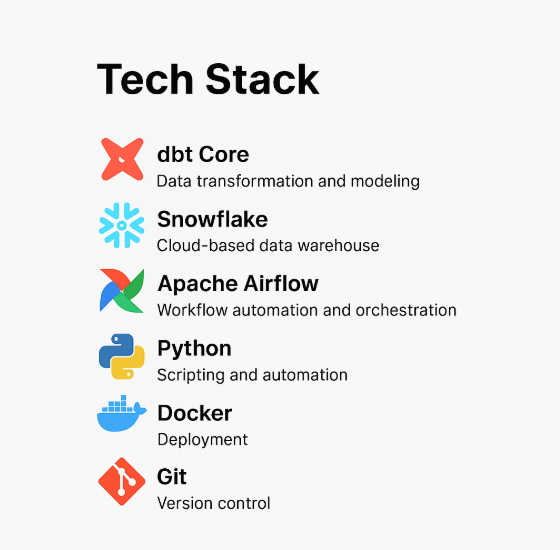

# Retail Modern Data Pipeline

## Overview
This project is a **complete data engineering pipeline** leveraging modern tools and best practices.  
It uses **dbt** for data transformation, **Snowflake** as the data warehouse, and **Apache Airflow** for workflow orchestration.  
The pipeline covers **data ingestion, transformation, and scheduling** in a structured manner.

## Tech Stack
- **dbt Core** – Data transformation and modeling  
- **Snowflake** – Cloud-based data warehouse  
- **Apache Airflow** – Workflow automation and orchestration  
- **Python** – Scripting and automation  
- **Docker** – Deployment
- **Git** – Version control  

## Features
- Automated data ingestion from multiple sources  
- Transformation and modeling using dbt  
- Scheduled workflows using Airflow  
- Scalable and modular architecture  

